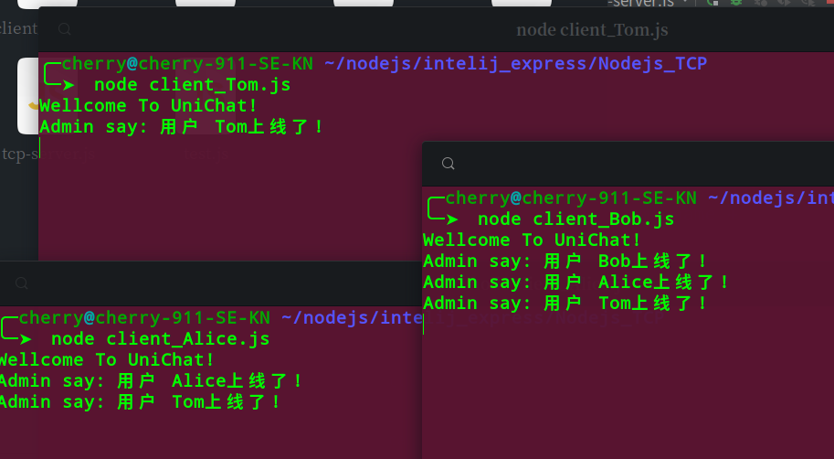
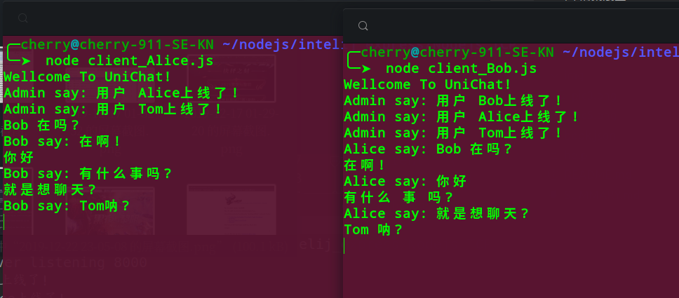
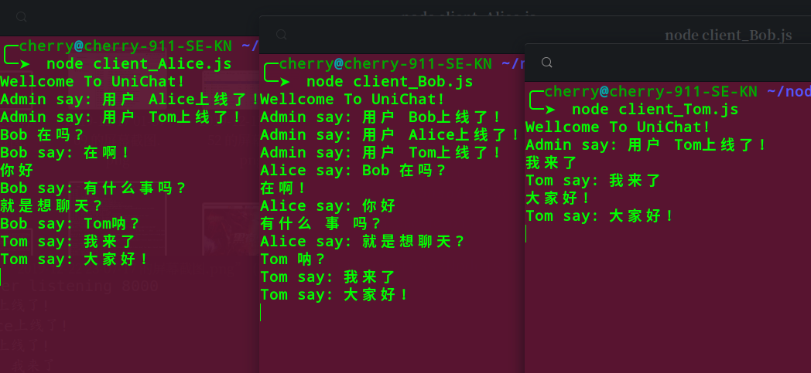
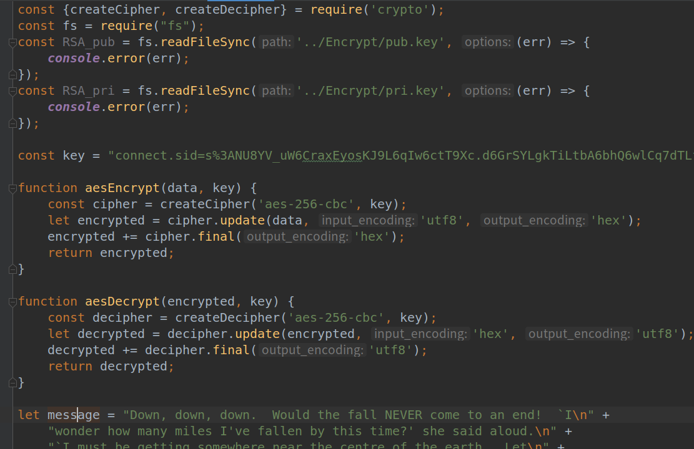
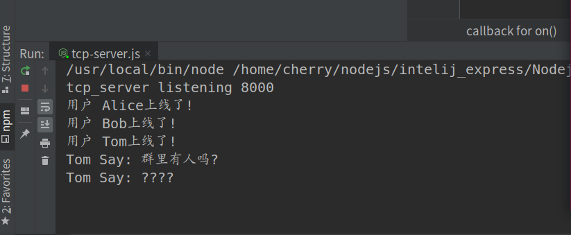

# 3. 聊天__In__Cli, 命令行聊天模式

### 一. 简介:
> 命令行聊天, 字如其意, 就是说用户可以直接通过命令行来聊天, 而无需启动图形化界面.

**实现的功能:**

* 用户之间可以单聊 
* 可以发送群聊消息
* `aes_256_cbc` , `RSA 1024`  消息加密

### 二. 简单效果展示

#### 初始状态, 用户上线

#### Alice 和 Bob 互相发送消息, 模拟用户之间的单聊

#### Alice, Bob, Tom 都在一个群里面, 模拟用户之间的多聊

#### Aes_256_Cbc, Rsa1024 保证消息的安全性

### 三. 服务端

